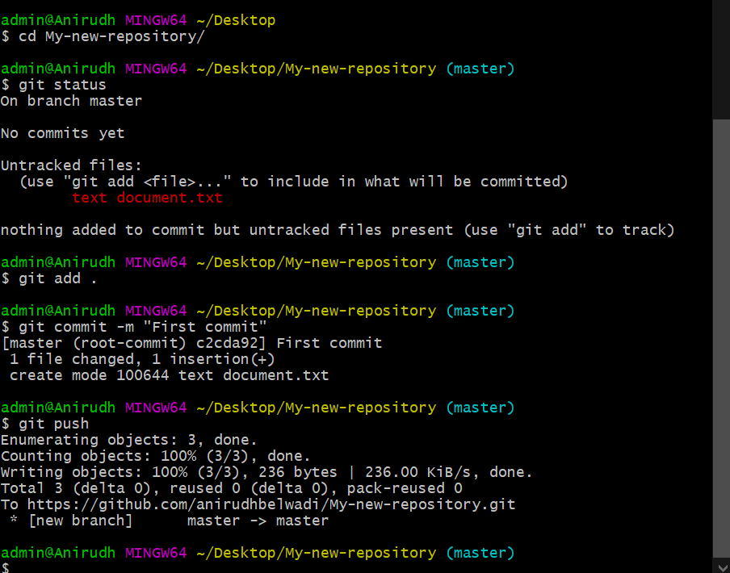

# Flask-and-Bootstrap4-Bootcamp
This is the Bootcamp that I organized for students to teach them Flask and Bootstrap4

## Setup
For Windows : 
- Download <b><a href="https://www.python.org/downloads/">Python</a></b> and follow the step to install latest version.

- Open Command Prompt and <b>Verify Python installation</b> with command : <code>py --version</code>
- Change working diectory to <b>Desktop</b>, Create a folder named <b>flask_app</b> and change your working directory to it, with command : <code>cd Desktop && mkdir flask_app && cd flask_app</code>
- <b>Install Virtual Environment</b> named env with command : <code>py -m venv env</code>
- <b>Activate Virtual Environment</b> with command : <code>env\Scripts\activate</code>
- <b>Install Flask</b> with command : <code>pip install flask</code>
- <b>Verify Flask installation</b> with command : <code>py -c "import flask; print(flask.&#95;&#95;version&#95;&#95;)"</code>
- <b>Deactivate Virtual Environment</b> with command : <code>deactivate</code>

## GitHub Repository Setup
- <b>Login/SignUp</b> into <a href="https://github.com/"><b>GitHub</b></a>.
- Go to your <b>repositories tab</b> : <code>https://github.com/<REPLACE_WITH_YOUR_USERNAME>?tab=repositories</code>
- Click on <b>New</b> to create a <b>New repository</b>.  
  

- In the next page, give a unique(within your account) repository name, keep the repository public, leave all other options at default and click on <b>Create Repository</b>. Do not close the next window, as we will be needing it in future.
- <b>Download Git Bash</b> from <a href="https://gitforwindows.org/">here</a>.
- Leave all options at defalut and follow instructions for installation, at the end <b>Deselect <i>View Release Notes</i></b>.
- Go back to the open <b>repository page<b> and click on the <b>clipboard button</b>.  
  

- Open <b>Start</b>, search for <b>Git Bash</b> and open it.
- Change working diectory to <b>Desktop</b> with command : <code>cd Desktop</code>
- <b>Clone</b> your newly created repository with command : <code>git clone <URL_COPIED_FROM_REPOSITORY_PAGE></code>
 For example <code>git clone https://github.com/anirudhbelwadi/My-new-repository.git</code> <cite style="color: green;">//Do Not Copy this.</cite>  
  

- <b>Create/copy your files</b> in(to) the new folder created on Desktop named by your repository name.
- Return to Git Bash and change working diectory to <b><REPOSITORY_NAME></b> with command : <code>cd <REPOSITORY_NAME></code>
 For example <code>cd My-new-repository/</code>&nbsp;&nbsp;<cite style="color: green;">//Do Not Copy this.</cite>

- Execute following commands to update the changes(to the GitHub repository) that you have made in your local machine(i.e. Copying/Modifying/Creating files) :  
<code>git status</code>&nbsp;&nbsp;<cite style="color: green;">//Shows status of file changes betwewen local machine and GitHub Remote Repository.</cite> 
<code>git add .</code>&nbsp;&nbsp;<cite style="color: green;">//Includes updates to all files in the next commit. You can also include single file with command : <code>git add <FILE_NAME></code></cite> 
<code>git commit -m "Type_your_commit_message"</code> <cite style="color: green;">//For example : git commit -m "First commit". This command saves changes in local repository.</cite> 
<code>git push</code>&nbsp;&nbsp;<cite style="color: green;">//Uploads local repository content to a remote repository.</cite>  
  

- Go back to the open <b>repository page</b> and <b>refresh</b> the page to see your newly updated files!